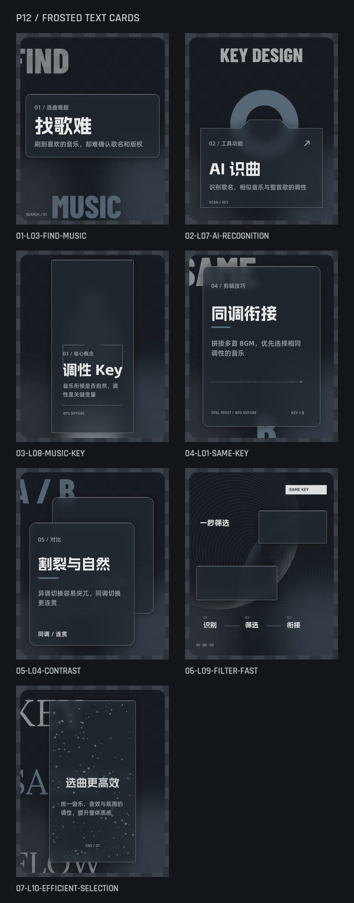
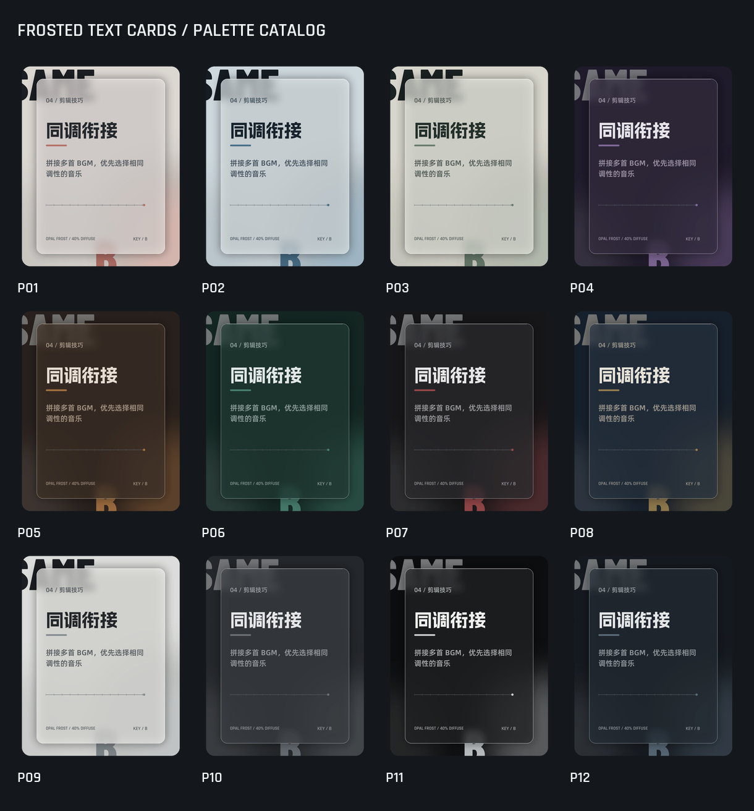

# Frosted Text Cards

把中文长文本提炼成一组可发布的关键词卡片，并生成具有半透明磨砂玻璃、严格文字层级和真实 Alpha 通道的 PNG。

> A reusable Codex skill and deterministic renderer for editorial frosted-glass text cards.



## 特点

- 将口语稿、教程、产品说明和经验分享拆成 4–8 张重点卡片。
- 生成前提供 12 套配色和 7 种版式选择。
- 自动识别问题、概念、方法、对比、流程和结论等语义角色。
- 使用确定性字体排版，中文内容保持准确。
- 输出 1080 × 1350 px RGBA PNG，包含透明、半透明和高不透明度像素。
- 支持 macOS、Windows 和 Linux 字体自动发现。

## 配色与版式



配色包含暖色、冷色、黑白灰和暗调方案。详细令牌见 [references/palettes.md](references/palettes.md)。

可用版式：

- L01 裁切字景
- L03 横向磨砂带
- L04 双层叠片
- L07 文件夹穿插
- L08 背光标本
- L09 纹理切片
- L10 凝露叠字

## 安装为 Codex Skill

```bash
git clone https://github.com/<your-name>/frosted-text-cards.git ~/.codex/skills/frosted-text-cards
```

打开新的 Codex 任务后调用：

```text
$frosted-text-cards 请把以下文本提炼并生成一组磨砂文字卡片：……
```

## 独立运行渲染器

需要 Python 3.10 或更高版本。

```bash
python3 -m venv .venv
source .venv/bin/activate
python3 -m pip install -r requirements.txt

python3 scripts/render_cards.py \
  --input references/example-series.json \
  --output output/demo \
  --palette P12
```

生成十二套配色目录：

```bash
python3 scripts/render_palette_catalog.py \
  --output examples/gallery/palette-catalog.png
```

## 字体

仓库不附带第三方字体文件。渲染器会在常见系统目录中寻找中文与西文字体，也支持环境变量覆盖。完整说明见 [assets/fonts/FONTS.md](assets/fonts/FONTS.md)。

## 输入格式

输入为 JSON，核心字段包括：

```json
{
  "series": {"palette": "P12"},
  "cards": [
    {
      "id": "01",
      "headline": "同调衔接",
      "support": "拼接多首 BGM，优先选择相同调性的音乐",
      "layout": "L01",
      "english_anchor": "SAME KEY",
      "metadata": "KEY / B"
    }
  ]
}
```

完整结构见 [references/card-schema.md](references/card-schema.md)，示例输入见 [references/example-series.json](references/example-series.json)。

## 项目结构

```text
frosted-text-cards/
├── SKILL.md
├── agents/openai.yaml
├── scripts/
│   ├── render_cards.py
│   └── render_palette_catalog.py
├── references/
├── assets/fonts/
├── examples/gallery/
├── requirements.txt
└── LICENSE
```

## 许可与署名

代码和 Skill 指令采用 MIT License。字体、用户文本和用户提供的图片仍遵循各自的许可证与权利归属。

Created by **joewill** with Codex.

## 发布到 GitHub

建议仓库描述：

> Turn Chinese long-form text into editorial frosted-glass PNG cards with a reusable Codex skill.

建议 Topics：

`codex-skill` · `generative-design` · `pillow` · `chinese-typography` · `social-media-cards`

```bash
git init -b main
git add .
git commit -m "Initial release: frosted-text-cards"
gh repo create frosted-text-cards --public --source=. --remote=origin --push
git tag v1.0.0
git push origin v1.0.0
```
